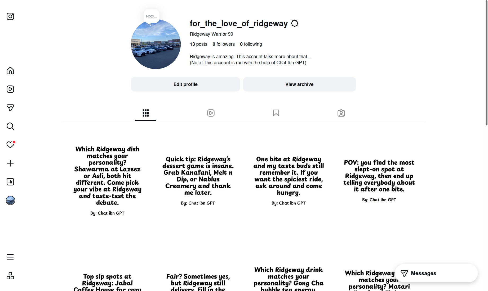

# Ridgeway Warrior

This app makes AI tell you how amazing Ridgway Plaza is. Check out the Instagram link at the right hand side to view more! 

## Ridgeway Plaza... What is it?

Ridgeway Plaza is claimed to be the "largest halal food destination in North America" ([thehalalfood.ca](https://thehalalfood.ca/blog/ridgeway-plaza/)). It's widely famed for its variety of halal food options alongside an array of specialty shops. 

Located at the edge of Mississauga, Ontario, Ridgeway Plaza is rumoured to be kind of an accident; it was planned to be an industrial-type complex, before the landlords decided to turn it into a halal-type plaza. 

If you've ever visited, that rumour is definitely believable. It's located next to a middle-class suburb that's, again, at the *very* edge of Mississauga ---  a large, urban city. 

The plaza consists of numerous strips of shops on a grid-type arrangement. Its got awkward parking lots and a confusing layout given its size. It's not really pedestrian friendly... even with more than 100 shops, I can't remember seeing a single bench. 

Here's a google maps street-view if you wanted to explore: [Ridgeway Plaza on Google Maps](https://www.google.com/maps/@43.5370553,-79.7254588,3a,75y,104.87h,86.08t/data=!3m7!1e1!3m5!1s5VZlRHTdRa-cMcsRt89IkQ!2e0!6shttps:%2F%2Fstreetviewpixels-pa.googleapis.com%2Fv1%2Fthumbnail%3Fcb_client%3Dmaps_sv.tactile%26w%3D900%26h%3D600%26pitch%3D3.9168281231861215%26panoid%3D5VZlRHTdRa-cMcsRt89IkQ%26yaw%3D104.86861378227438!7i16384!8i8192?entry=ttu&g_ep=EgoyMDI2MDcxNS4wIKXMDSoASAFQAw%3D%3D)

(Note: Do not use Google Maps if you're looking for a specific shop. That's Ridgway 101)

But... with many things that accidently become a success, you can't really hit pause to fix it. It's going to continue to grow, even if we didn't plan for it to do so.

So, we should just accept it, right?

## The Social Stigma

Saying you like... more or less *love* Ridgeway Plaza can almost be considered social suicide. How? Well, let me show you some headlines:

- [16-year-old boy charged in Mississauga stabbing after ‘road rage incident’: police](https://globalnews.ca/news/9637511/eglinton-avenue-ridgeway-drive-stabbing/) (Apr 19, 2023)

- [‘There’s no rules’: This GTA strip mall has become a foodie haven. Its booming popularity has made it a hazard for nearby residents](https://www.thestar.com/news/gta/there-s-no-rules-this-gta-strip-mall-has-become-a-foodie-haven-its-booming/article_7a1a2a25-39c5-5740-b237-bfab33d0af25.html) (Jan 10, 2024)

- [Mississauga takes legal action to address ongoing safety concerns at Ridgeway Plaza](https://www.mississauga.ca/city-of-mississauga-news/news/mississauga-takes-legal-action-to-address-ongoing-safety-concerns-at-ridgeway-plaza/) (Aug 13, 2025)
    - "The City of Mississauga initiated a request for an injunction at the plaza after two years of nuisance gatherings, altercations, street racing, and illegal fireworks, amongst other disturbances. Despite enhanced enforcement efforts and several attempts to work with the plaza condominium corporations, the issues continue."

- [‘Extremely effective’: Fines, charges handed out during Mississauga plaza injunction](https://globalnews.ca/news/11354014/ridgeway-plaza-fines-charges-mississauga-court-injunction/) (Aug 28, 2025)

- [City of Mississauga imposes new restaurant restrictions at Ridgeway Plaza after past complaints](https://toronto.citynews.ca/2026/01/14/mississauga-ridgeway-plaza-restrictions/) (Jan 14, 2026)

- [ A night at Mississauga’s Ridgeway Plaza: As Ramadan ends, hundreds break their fast at the vital late-night hub ](https://www.thestar.com/news/gta/a-night-at-mississaugas-ridgeway-plaza-as-ramadan-ends-hundreds-break-their-fast-at-the-vital-late-night-hub/article_a8de5cb9-78a7-47a4-95d8-c71c99483ed8.html) (March 20, 2026)

- [Ridgeway Plaza owners to install gates, security cameras in new Mississauga deal](https://globalnews.ca/news/11803934/mississauga-ridgeway-plaza-security/) (April 16, 2026)
